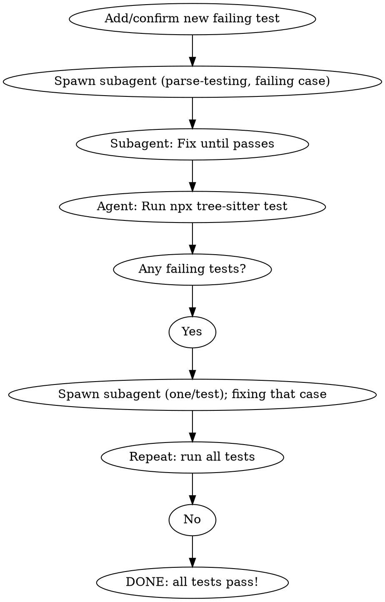

# Tree-Sitter TDD Skill

## Overview

Use this skill when adding a new F# language feature to the tree-sitter parser. This skill automates the TDD workflow: write test first, get Fantomas AST, map to tree-sitter format, verify with user, and then strictly orchestrate multi-agent iteration—spawning per-test subagents for parse fixes until **all** test cases pass. Full green suite is mandatory.

**Critical:** This workflow loops—using delegated subagents—until ALL tests pass. Adding a feature may break existing tests; every breakage is isolated and fixed before success is declared.

## When to Use

- Adding a new language feature (e.g., new expression type, pattern, keyword)
- Fixing a parsing issue with existing syntax

## Prerequisite

- The script `ast_parser.fsx` at project root **must** accept the code example as a command-line argument. If it does not, update the script before continuing. See Step 1 for the exact required change.

## Input

The user provides:

1. **F# code snippet** to parse
2. **Test name** (e.g., "nullable type")
3. **Corpus file** (e.g., `test/corpus/type_defn.txt`)

## Workflow

### Multi-Agent Orchestration Pattern

After a new test is written and (expectedly) fails, use the following orchestration:

- Spawn a subagent (with the `tree-sitter-parse-testing` skill) to iterate on parser and grammar _only for the failing example_ until it parses as required.
- Once that test parses, run the entire test suite (`npx tree-sitter test`).
- For every other test that fails, spawn a new subagent, each focusing solely on its failing case.
- Continue this loop, always re-running and spawning as needed, until **all** tests pass.
- Never “fix everything at once”; maintain one-failure-at-a-time discipline per subagent.

This coordination ensures robust TDD and protects against missed breakages elsewhere in the corpus. (See Step 7 for concrete mechanics.)

### Step 1: Get Fantomas AST

ALWAYS use the helper script `.opencode/ast_parser.fsx` in the repository to obtain the Fantomas AST for your F# code example.

**If the script does not accept input as a command-line parameter, update it so that it sets the sample code from the command line argument instead of any hardcoded value.**

- Replace any occurrences of `let sample = ...` with:
  ```fsharp
  let sample = fsi.CommandLineArgs |> Seq.skip 1 |> String.concat " "
  ```
- This enables passing the code example directly when invoking the script.

**Then run:**

```bash
dotnet fsi .opencode/ast_parser.fsx -- "<F# code example to test>"
```

This ensures that your code snippet is always parsed accurately for each test, avoids manual copy-paste errors, and standardizes the workflow.

### Step 2: Read Grammar

Read the parser's `src/grammar.json` to get valid node names:

```bash
cat fsharp/src/grammar.json | jq '.rules | keys'
```

### Step 3: Map AST to Tree-Sitter Format

Convert Fantomas AST to tree-sitter lisp format:

```
(file
  (declaration_expression
    (function_or_value_defn
      (value_declaration_left
        (identifier_pattern
          (long_identifier_or_op
            (identifier))))
      (const
        (string)))))
```

Use these mappings (add as needed):

- `Let` → `declaration_expression`
- `SynIdent` → `identifier`
- `Const` → `constant`
- `Int32` → `integer`
- `String` → `string`

### Step 4: Ask User for Unknown Nodes

If you encounter a Fantomas AST node that doesn't map to any node in grammar.json:

1. Propose a new node name based on F# language spec
2. Use `question` tool to ask user:

```
header: "New node name"
question: "Found Fantomas node 'X' that doesn't map to grammar. What's the tree-sitter node name?"
options:
  - label: "proposed_name"
    description: "Use proposed name based on F# spec"
  - label: "custom"
    description: "Enter custom name"
```

### Step 5: Verify Parse Tree

Show the user the expected parse tree and ask for verification:

```
header: "Verify parse tree"
question: "Does this parse tree look correct?"
options:
  - label: "Yes, add test"
    description: "Proceed to add test to corpus"
  - label: "No, fix mapping"
    description: "Revise node mappings"
```

### Step 6: Add Test to Corpus

Add the test to the specified corpus file:

```
================================================================================
test-name
================================================================================

<user's F# code>

--------------------------------------------------------------------------------

(expected parse tree)
```

### Step 6: Run Tests

```bash
npx tree-sitter test
```

- Always run the full suite after each fix/change; never trust partial green results. See below for full orchestration.

### Step 7: Multi-Agent Test Fixing and Orchestration (Loop Until All Pass)

**IMPORTANT:** Adding a new feature may break existing tests. You MUST loop until every test passes. ALL fixes should follow multi-agent TDD:

1. After confirming the new test fails, the main agent spawns a subagent (using the `tree-sitter-parse-testing` skill) assigned to that single failing case. The subagent iterates on grammar/debugging until that test parses as expected (no ERROR nodes).
2. When the case parses, the main agent runs:
   ```bash
   npx tree-sitter test
   ```
   This executes the full test suite.
3. If further tests fail (including old ones):
   - The main agent spawns a new subagent for _one of the failing test_ (using `tree-sitter-parse-testing`, providing the specific code and expected tree).
   - the Subagent only work on ONE failing test at a time—never batch.
4. When the subagent report their test passes, the main agent re-runs the full test suite.
5. Repeat this loop, spawning new subagents for any failures, until ALL TESTS PASS.
   - Only when the _entire_ suite is green is the feature considered implemented.

#### Multi-Agent Orchestration Flowchart (pseudo-dot)



#### Quick Reference Table

| Action       | Agent/Skill                            | Description                                          |
| ------------ | -------------------------------------- | ---------------------------------------------------- |
| Add test     | Main agent                             | Write new corpus case, confirm it fails              |
| Debug/fixone | Subagent (`tree-sitter-parse-testing`) | Fix parsing for that individual test                 |
| Test suite   | Main agent                             | `npx tree-sitter test` - check all cases             |
| Handle fail  | Main agent                             | Spawn subagents _per failing test_, loop until green |

#### Common Mistakes & Red Flags

- Stopping when only the new or one test passes (must loop until suite is fully green)
- Not re-running full suite after every fix
- Fixing errors for multiple failing tests in one subagent (fan-out—each subagent is one-to-one)
- Rationalizing partial fix (“close enough”)—never allowed
- Declaring done when any case still fails

### Step 8: Verify Complete

Confirm all tests pass and the new feature parses correctly.

## Notes on Code Example Input

- Always ensure the exact code sample for your test is supplied as a command-line argument to `ast_parser.fsx`. This eliminates discrepancies between test and AST.

## Key Rule (Discipline-Enforcement)

**NO CASES LEFT FAILING:** Never declare the feature/fix complete until the main agent runs the FULL test suite and every single test is green. ALWAYS use per-case subagents for debugging, never batch fix. Any attempt to declare partial results "done" is a violation of TDD discipline and must be explicitly rejected.

## Test Output Handling and Automation

### Automated Parsing of Test Output

After running `npx tree-sitter test`, you MUST automatically and robustly parse all CLI output to:

- Identify each test's name, pass/fail status, and summary results.
- For every \✗ (fail), extract the test name and spawn a dedicated subagent/
  action to fix ONLY that failing case (never batch).
- For edge cases (infinite loop, crash, "Killed", incomplete/timed-out output),
  halt and alert, do NOT declare pass/fail—require intervention for investigation.
- Never pause to request user input after test execution; always proceed immediately according to test results.

**Sample npx tree-sitter test Output**

Passing case:

```
✓ simple string
  test/corpus/constants.txt
```

Failing case:

```
✗ simple string
  test/corpus/constants.txt
  --- Expected
  +++ Actual
  ...
  (tree diff here)
```

Summary example:

```
60/61 tests passed (1 failing)
```

Infinite loop/truncation warning (edge case CLI output):

```
Killed
<no summary>
```

### Recommended Output Parsing (Pseudocode)

```python
for each line in output:
    if line.startswith('✓ '):
        # Passed test, extract name (optional, mostly for reporting)
        mark_test_passed(test_name)
    elif line.startswith('✗ '):
        # Failing test, extract name
        failing_tests.append(test_name)
if 'Killed' in output or 'timed out' in output:
    handle_infinite_loop_or_crash()
if summary_line_reports_failures:
    for test in failing_tests:
        spawn_agent_for_failure(test)
else:
    declare_suite_green()
```

- Use regular expressions or simple prefix checks to robustly parse lines.
- Always cross-check summary (e.g., "X/Y tests passed") for confirmation.
- On any unclear/edge output, escalate immediately; do NOT risk false success/failure.

### Edge Case Handling

- If output is truncated, contains 'Killed', 'timed out', or otherwise incomplete, flag as test infrastructure issue.
- Never declare TDD suite complete unless 100% of cases are green and summary confirms zero failures.

### Key Rules for Output Automation

- After every test run, parse all output and immediately act (trigger new subagents or declare pass). Never pause.
- No fix or iteration can skip this output step.

---

## Test Format Example

```
================================================================================
nullable type
================================================================================

let x: int? = 1

--------------------------------------------------------------------------------

(file
  (declaration_expression
    (function_or_value_defn
      (value_declaration_left
        (identifier_pattern
          (long_identifier_or_op
            (identifier))))
      (type
        (nullable_type
          (type)))
      (const
        (integer)))))
```

## Parser Selection

- `.fs` / `.fsx` files → use `fsharp/` parser
- `.fsi` files → use `fsharp_signature/` parser

## Key Commands and Workflow Summary

| Command                                   | Description                                 |
| ----------------------------------------- | ------------------------------------------- |
| `npx tree-sitter test`                    | Run all tests                               |
| `cd fsharp && npx tree-sitter generate`   | Regenerate parser after grammar changes     |
| `echo 'code' \| npx tree-sitter parse`    | Parse code snippet                          |
| `echo 'code' \| npx tree-sitter parse -d` | Debug parse (see tree-sitter-parse-testing) |

**Workflow Recap:**

- For every failing test: spawn a single subagent to fix that case. Never batch.
- Run all tests after every fix; repeat subagent assignment/fixing as needed.
- You may only declare success when 0 failures remain. Enforce this at every iteration.
